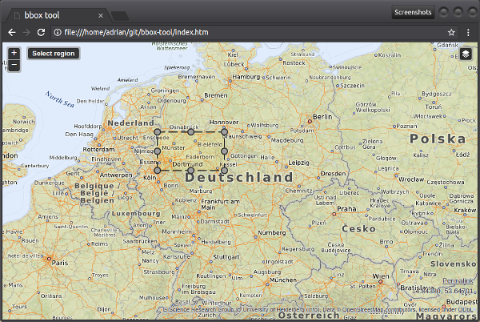

# OPAL Spatial Slicing

* How to run: Clone/download this repository and open index.htm in your browser ([example](https://projekt-opal.github.io/hackathon/geo/))
* Optional: Add parameters _redirect_, _key_ and _value_ to enable a redirect with the resulting bounding box coordinates ([example](https://projekt-opal.github.io/hackathon/geo/?redirect=http%3A%2F%2Flocalhost%3A8081%2FgetGeoDatasetsHtml&key=urlPrefix&value=http%3A%2F%2Flocalhost%3A3000%2Fview%2FdatasetView%3Furi%3D))
* Use the "Select region" button to extract coordinates
* Part of the [OPAL Open Data Hackathon](https://projekt-opal.github.io/hackathon/)
* Development notes in the [wiki](https://github.com/adibaba/HackathonBoundingBox/wiki)
* Original code: Norbert Renner [@nrenner](https://github.com/nrenner), for used BSD licenses see [README-bbox-tool.md](README-bbox-tool.md)

## Credits

[Data Science Group (DICE)](https://dice-research.org/) at [Paderborn University](https://www.uni-paderborn.de/)

This work has been supported by the German Federal Ministry of Transport and Digital Infrastructure (BMVI) in the project [Open Data Portal Germany (OPAL)](https://dice-research.org/OPAL) (funding code 19F2028A).