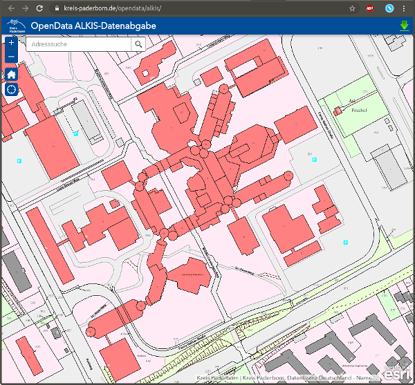
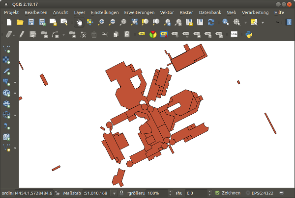

# Open Data Paderborn

The Paderborn district offers a [service to download Paderborn geodata](https://www.kreis-paderborn.de/kreis_paderborn/geoportal/opendata/).
On the website, you can draw a polygon and enter your e-mail address for download.

## Data format

The data is structured by the [Geography Markup Language (GML)](https://en.wikipedia.org/wiki/Geography_Markup_Language), a XML format.
You can use the [QGIS (Wikipedia)](https://en.wikipedia.org/wiki/QGIS) software to explore it.
For downloads, see the [QGIS download website](https://www.qgis.org/de/site/forusers/download.html).
Maybe you want to write a SAX parser?

[Start page](index.md)
